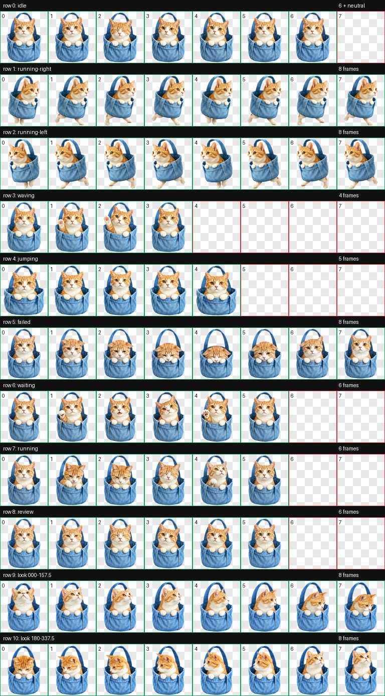

# didi-codex-pet

`didi` is a Codex-compatible animated v2 pet: a ginger-and-white tabby peeking from a soft blue fabric carrier.



## Features

- Nine standard Codex animation states
- Sixteen clockwise look directions
- Transparent WebP spritesheet
- Codex pet format v2
- 8 columns × 11 rows, 192 × 208 pixels per cell

## Install

### macOS and Linux

```bash
git clone https://github.com/HTHou/didi-codex-pet.git
mkdir -p ~/.codex/pets
cp -R didi-codex-pet/didi ~/.codex/pets/didi
```

Restart Codex if the pet does not appear immediately.

The installed files should be:

```text
~/.codex/pets/didi/pet.json
~/.codex/pets/didi/spritesheet.webp
```

### Manual installation

Download the latest release, extract it, and copy the included `didi` directory into the `pets` directory under your Codex home directory.

## Preview

- [Full animation contact sheet](preview/contact-sheet.png)
- [Look-direction sheet](preview/look-directions.png)

## License

MIT License. See [LICENSE](LICENSE).
